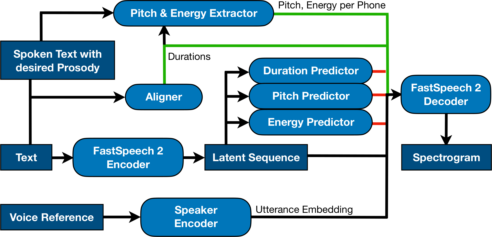

## Official Code

[https://github.com/DigitalPhonetics/IMS-Toucan](https://github.com/DigitalPhonetics/IMS-Toucan)

## Interactive Demo

[Hosted on Huggingface🤗 Spaces](https://huggingface.co/spaces/Flux9665/SpeechCloning)

## Audio Samples

- 
 Don't forget what they said yesterday, 
 
 two 

 policemen is excessive.      

    <table style='width: 100%;'>
        <tr>
            <td>Reference Human Speech</td>
            <td><audio controls="" ><source src="resources/human/9.wav" type="audio/wav"></audio></td></tr><tr>
            <td>Copy Style and Voice</td>
            <td><audio controls="" ><source src="resources/same_voice_same_style/9.wav" type="audio/wav"></audio></td></tr><tr>
            <td>Copy Style, but convert to different Voice</td>
            <td><audio controls="" ><source src="resources/diff_voice_same_style/9.wav" type="audio/wav"></audio></td></tr><tr>
            <td>Just copy the Voice, ignore style</td>
            <td><audio controls="" ><source src="resources/same_voice_diff_style/9.wav" type="audio/wav"></audio></td></tr><tr>
        </tr>
    </table>

- 
 I said, 
 
 I 

 have won, when they asked.      

    <table style='width: 100%;'>
        <tr>
            <td>Reference Human Speech</td>
            <td><audio controls="" ><source src="resources/human/8.wav" type="audio/wav"></audio></td></tr><tr>
            <td>Copy Style and Voice</td>
            <td><audio controls="" ><source src="resources/same_voice_same_style/8.wav" type="audio/wav"></audio></td></tr><tr>
            <td>Copy Style, but convert to different Voice</td>
            <td><audio controls="" ><source src="resources/diff_voice_same_style/8.wav" type="audio/wav"></audio></td></tr><tr>
            <td>Just copy the Voice, ignore style</td>
            <td><audio controls="" ><source src="resources/same_voice_diff_style/8.wav" type="audio/wav"></audio></td></tr><tr>
        </tr>
    </table>
    
- 
 Everybody here in this room can agree, that 
 
 two 

 lovebirds is annoying.      

    <table style='width: 100%;'>
        <tr>
            <td>Reference Human Speech</td>
            <td><audio controls="" ><source src="resources/human/6.wav" type="audio/wav"></audio></td></tr><tr>
            <td>Copy Style and Voice</td>
            <td><audio controls="" ><source src="resources/same_voice_same_style/6.wav" type="audio/wav"></audio></td></tr><tr>
            <td>Copy Style, but convert to different Voice</td>
            <td><audio controls="" ><source src="resources/diff_voice_same_style/6.wav" type="audio/wav"></audio></td></tr><tr>
            <td>Just copy the Voice, ignore style</td>
            <td><audio controls="" ><source src="resources/same_voice_diff_style/6.wav" type="audio/wav"></audio></td></tr><tr>
        </tr>
    </table>

- 
 As soon as we arrived at the farm 
 
 yesterday

, we saw that they were milking cows.      

    <table style='width: 100%;'>
        <tr>
            <td>Reference Human Speech</td>
            <td><audio controls="" ><source src="resources/human/3.wav" type="audio/wav"></audio></td></tr><tr>
            <td>Copy Style and Voice</td>
            <td><audio controls="" ><source src="resources/same_voice_same_style/3.wav" type="audio/wav"></audio></td></tr><tr>
            <td>Copy Style, but convert to different Voice</td>
            <td><audio controls="" ><source src="resources/diff_voice_same_style/3.wav" type="audio/wav"></audio></td></tr><tr>
            <td>Just copy the Voice, ignore style</td>
            <td><audio controls="" ><source src="resources/same_voice_diff_style/3.wav" type="audio/wav"></audio></td></tr><tr>
        </tr>
    </table>
    
- 
 Ghost beckons HAMLET
 HORATIO: It beckons you to go away with it, as if it some impartment did desire to you alone.
 MARCELLUS: Look, with what courteous action it waves you to a more removed ground: But do not go with it.
 HORATIO: No, by no means.
 HAMLET: It will not speak; then I will follow it.
 HORATIO: Do not, my lord.
 HAMLET: Why, what should be the fear? I do not set my life in a pin's fee; and for my soul, what can it do to that, being a thing immortal as itself? It waves me forth again: I'll follow it.      

<table style='width: 100%;'>
        <tr>
            <td>Reference Human Speech</td>
            <td><audio controls="" ><source src="resources/human/3.wav" type="audio/wav"></audio></td></tr><tr>
            <td>Copy Style, but make each Character have a unique voice</td>
            <td><audio controls="" ><source src="resources/same_voice_same_style/3.wav" type="audio/wav"></audio></td></tr><tr>
            <td>Copy Style, but make each Character have a unique voice</td>
            <td><audio controls="" ><source src="resources/diff_voice_same_style/3.wav" type="audio/wav"></audio></td></tr><tr>
        </tr>
    </table>
